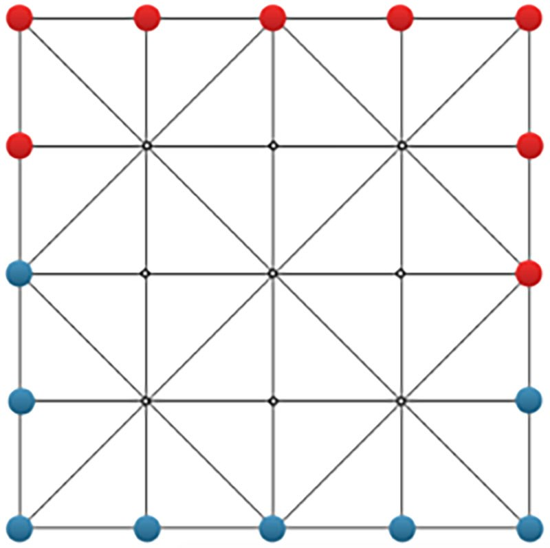

# Ganh

## Rule

A 2 player game.

### Board

4*4 squares with 25 intersection.

### Piece

Each player has 16 pieces.
The initial position is the layed out as above.

### Move

A piece can move along the edges speicified on the board to an empty itersection.

#### Carry

A piece move into an intersection between 2 opponent's pieces and  form a line with those 2 pieces -> turn those 2 pieces to yours.

#### Surround

Surround the opponent's pieces in a way that they can't be moved -> turn those pieces to yours.

#### Open

If your move gives the opponent an oppotunity to carry, your opponent has to carry